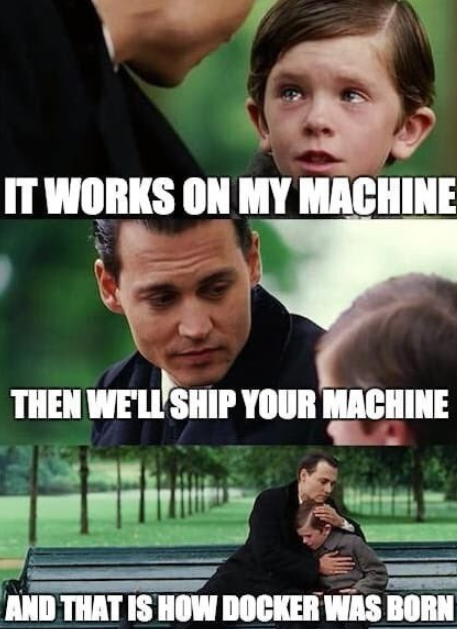

class: center, middle

# I wrote dockerfiles for a week. This is what I learned
## #6 will shock you!

<br />

### Loris Bognanni
#### Nov 2024

.bottom-notes[
<a href="https://github.com/LBognanni/docker-tips/blob/main/text.md"></a>
<a href="https://github.com/LBognanni/docker-tips"></a> 
]

---

layout: true

.title[
    I wrote dockerfiles for a week. This is what I learned]

---

## What is Docker?

**TLDR:**
  - Docker is a tool that allows you to run applications in containers.
  - Containers are isolated environments that run on the host machine.
  - It solves the "it works on my machine" problem.


---

## Core Components
- 🖼️ **Images:** Read-only templates for containers.
- 📦️ **Containers:** Running instances of images.
- 📜 **Dockerfile:** Script to define an image.
- 🐋 **Docker Engine:** Runtime for building and running containers.

<br />

#### In practice:
 - We upload images to ECR (Elastic Container Registry).
 - We run containers in ECS or Fargate. 


---

## Dockerfile Basics
#### Key Commands
  - `FROM`: Specifies the base image.
  - `WORKDIR`: Sets the working directory.
  - `COPY`: Copy files into the image.
  - `RUN`: Execute commands at build time.
  - `CMD`: Specify the container's runtime command.

---

## Example Dockerfile

```dockerfile
FROM python:3.12
WORKDIR /usr/local/app

# Install the application dependencies
COPY requirements.txt ./
RUN pip install --no-cache-dir -r requirements.txt

# Copy in the source code
COPY src ./src
EXPOSE 5000

# Setup an app user so the container doesn't run as the root user
RUN useradd app
USER app

CMD ["uvicorn", "app.main:app", "--host", "0.0.0.0", "--port", "80"]
```

This will create an image for an example Python web application.

---
